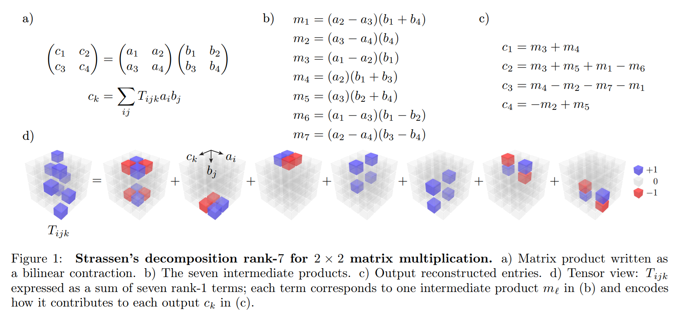
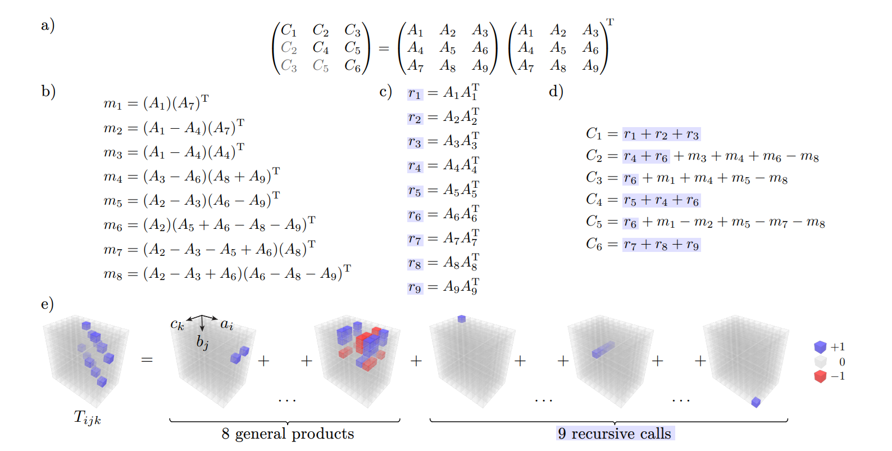
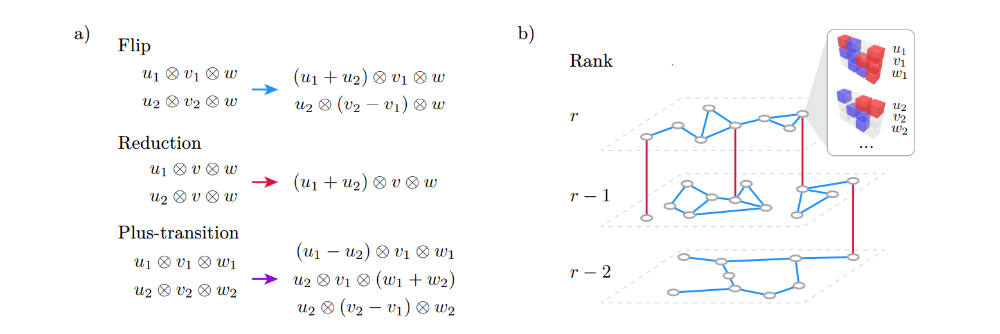

# flip-cpd: Flip-Graph Search for Canonical Polyadic Decomposition

[](https://www.arxiv.org/pdf/2502.13266)
[](https://qdiag.xyz/cpd/)

<!-- > Flip-graph search for low-rank CP decompositions of matrix multiplication tensors and structured matrix formats. -->

<!-- ## Motivation -->

Matrix multiplication algorithms can be viewed as canonical polyadic (CP) decompositions of the matrix multiplication tensor. Classic examples such as Strassen’s 2×2 algorithm show that the same bilinear map can admit very different ranks, and that reducing this rank directly translates into fewer scalar multiplications.

<p align="center">
  <picture>
    <source media="(prefers-color-scheme: dark)" srcset="docs/assets/fig1-dark.png">
    <source media="(prefers-color-scheme: light)" srcset="docs/assets/fig1.png">
    
  </picture>
</p>

Figure 1 illustrates this idea on the small nontrivial example: naive 2×2 matrix multiplication uses eight scalar multiplications, while a Strassen-like scheme needs only seven. Both algorithms correspond to different CP decompositions of the same tensor. The aim of this project is to automate the search for such low-rank decompositions.

Many kernels that appear in linear algebra libraries and machine learning workloads are not arbitrary dense products but have additional structure, such as products of the form $G G^\mathrm{T}$ (SYRK). In these settings multiplicative coefficient in the asymptotic complexity can be reduced.

<p align="center">
  <picture>
    <source media="(prefers-color-scheme: dark)" srcset="docs/assets/fig2-dark.png">
    <source media="(prefers-color-scheme: light)" srcset="docs/assets/fig2.png">
    
  </picture>
</p>

Figure 2 shows how exploiting structure in $G G^\mathrm{T}$ products leads to schemes that are cheaper than applying a generic fast matrix multiplication algorithm to the same problem. The code in this repository is designed to search exactly this kind of structured schemes.

At the core of the approach is a flip graph over bilinear schemes. Each node of this graph represents a CP decomposition (an algorithm) for a fixed bilinear map, and edges correspond to local algebraic transformations that preserve correctness while altering the internal structure of the scheme. By performing random walks and local improvements on this graph over finite fields, and then lifting the resulting decompositions to \(\mathbb{Z}\) or \(\mathbb{Q}\), the implementation explores the space of algorithms. 

<p align="center">
  <picture>
    <source media="(prefers-color-scheme: dark)" srcset="docs/assets/fig3-dark.png">
    <source media="(prefers-color-scheme: light)" srcset="docs/assets/fig3.png">
    
  </picture>
</p>

Figure 3 sketches this flip graph viewpoint. The `flip-cpd` repository provides the toolchain needed to work with it.

## Citation

If you use this code or the accompanying datasets in academic work, please cite:

```bibtex
@misc{khoruzhii_2025,
  title         = {Faster Algorithms for Structured Matrix Multiplication via Flip Graph Search},
  author        = {Kirill Khoruzhii and Patrick Gelß and Sebastian Pokutta},
  year          = {2025},
  archivePrefix = {arXiv},
  primaryClass  = {cs.SC}
}
```
